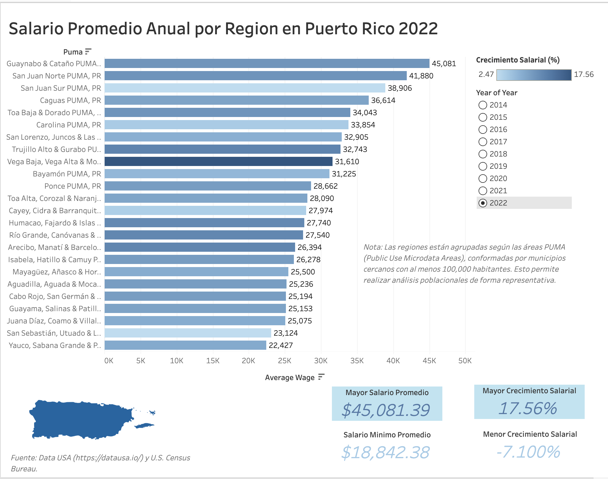

# Análisis de Salarios por Región en Puerto Rico

Este proyecto presenta un análisis detallado de los salarios promedio y el crecimiento salarial por región en Puerto Rico, utilizando datos oficiales de fuentes públicas. La visualización de los resultados se realizó en Tableau, y el proceso de limpieza y preparación de los datos fue documentado en un Jupyter Notebook.

---



## Estructura del Proyecto

```
├── data/
│   ├── raw/                  # Datos originales sin procesar
│   └── processed/            # Datos limpios y listos para análisis
├── notebooks/                # Notebook de limpieza de datos
├── src/                      # Scripts de limpieza de datos
├── tableau/                  # Dashboard de Tableau (capturas o enlaces)
└── README.md                 # Documentación del proyecto
```

---

## Descripción del Análisis

- Eliminación de columnas irrelevantes.
- Limpieza y estandarización de los nombres de las columnas.
- Manejo de valores nulos en la columna `Growth`, asignando `'N/A'` cuando no existe información de crecimiento salarial.
- Redondeo de los valores numéricos para una mejor visualización.
- Visualización de los resultados mediante un Dashboard interactivo en Tableau.

---

## Visualización Interactiva

- Accede al dashboard en Tableau Public:  
[🔗 Ver Dashboard en Tableau Public](https://public.tableau.com/views/SalariosyCrecimientosenPuertoRico2014-2022/Dashboard1?:language=en-US&:sid=&:redirect=auth&:display_count=n&:origin=viz_share_link)

---

## Jupyter Notebook

Consulta el proceso completo de limpieza de datos:  
[ Ver Notebook de Limpieza de Datos](./notebooks/data_cleaning_avg_wage_puerto_rico.ipynb)

---

## Fuentes de Datos

- [Data USA](https://datausa.io/)
- U.S. Census Bureau

---

## Conclusión

Este proyecto demuestra cómo realizar un análisis de datos completo, desde la adquisición y limpieza hasta la visualización de resultados. Es ideal para quienes desean comprender mejor la situación salarial por región en Puerto Rico y practicar habilidades en **Python (pandas)**, **Jupyter Notebooks** y **Tableau**.

---